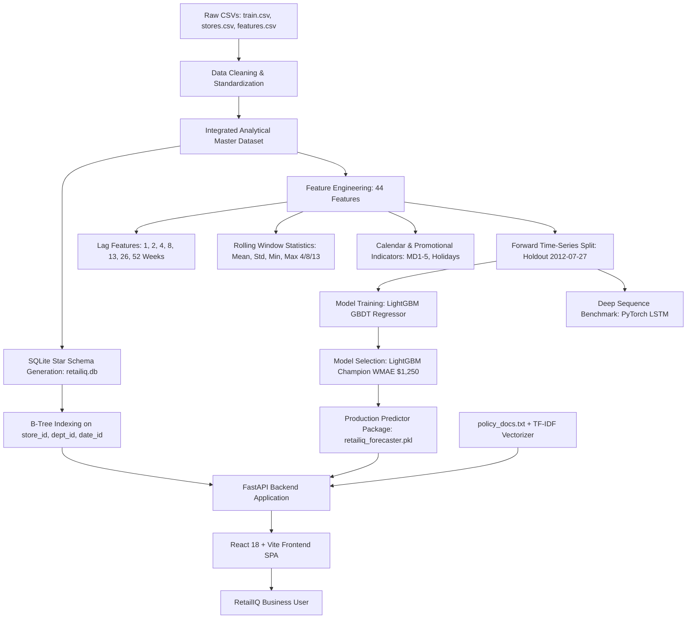

# RetailIQ Data Engineering & Machine Learning Workflow

```mermaid
graph TD
    A[Raw CSVs: train.csv, stores.csv, features.csv] --> B[Data Cleaning & Standardization]
    B --> C[Integrated Analytical Master Dataset]
    
    C --> D1[SQLite Star Schema Generation: retailiq.db]
    D1 --> D2[B-Tree Indexing on store_id, dept_id, date_id]
    
    C --> E1[Feature Engineering: 44 Features]
    E1 --> E2[Lag Features: 1, 2, 4, 8, 13, 26, 52 Weeks]
    E1 --> E3[Rolling Window Statistics: Mean, Std, Min, Max 4/8/13]
    E1 --> E4[Calendar & Promotional Indicators: MD1-5, Holidays]
    
    E1 --> F1[Forward Time-Series Split: Holdout 2012-07-27]
    F1 --> G1[Model Training: LightGBM GBDT Regressor]
    F1 --> G2[Deep Sequence Benchmark: PyTorch LSTM]
    
    G1 --> H[Model Selection: LightGBM Champion WMAE $1,250]
    H --> I[Production Predictor Package: retailiq_forecaster.pkl]
    
    D2 --> J[FastAPI Backend Application]
    I --> J
    K[policy_docs.txt + TF-IDF Vectorizer] --> J
    
    J --> L[React 18 + Vite Frontend SPA]
    L --> M[RetailIQ Business User]
```
